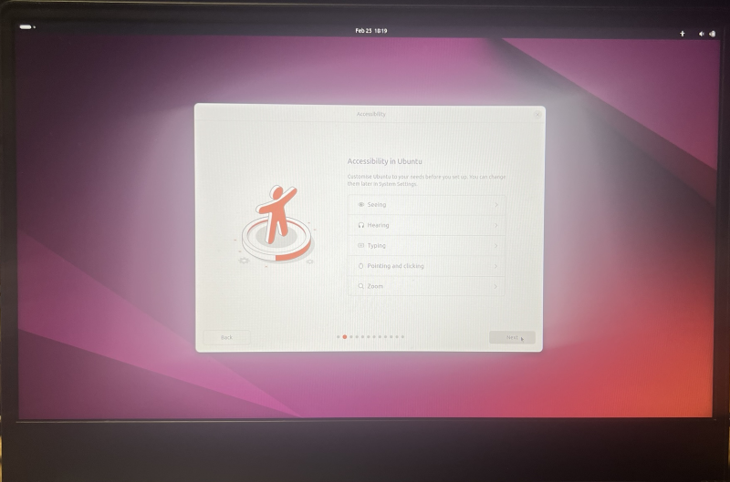

## Course preparations - Linux  

As we are going to go through programming stuff, there's no other way like to do it
in unix-like environment. Why this choice? Well, as much developer, as many answers
can be. I can share my thoughts on this matter.

When I've been starting to learn programming I loved to use my mac. My reason, why
I like unix-like systems is their stability and security. I had so many troubles
using Windows laptops (I had to, as my main job is automation engineering), especially,
when network connections had poor conditions, or one of the programs stopped responding. 
Computer in those cases was unusable. But in unix-like system, you can just kill the
process, and continue your work.  
Next reason was hardware requirements. If Windows works not so fast on your laptop, Linux
will be much faster and reliable.  
Last (my) reason is a huge library of development tools, which gives you ... freedom
of choice :)

1. ### Bootable media preparation

You will need a few things, to proceed with Linux installation:
* USB memory stick, at least 8GB
* ISO file with Linux
* Tool to create bootable USB stick

Theres a lot of Linux distribution available (Arch, Debian, Mint etc.), however
Ubuntu seems to be most popular, and easiest to start with. To create bootable
USB stick with installation, you need to download ISO image from [here](https://ubuntu.com/download/desktop).
Choose a version with LTS (Long Time Support), as it is longer supported.

Next step will be to download a tool, that will make your USB stick bootable
with written ISO image on it. Again, there's big choice of such tools, however
I always use Rufus (download from [here](https://rufus.ie/en/)).

Now we will go through preparation of your installation media:
After you open Rufus, you see something like on picture below:

Next thing you need to do is to choose you USB stick:

By clicking **SELECT** you will choose ISO image to be written on USB stick:

When everything will be ready, you will se your USB stick, Ubuntu image,
status from Rufus ready. Just click Start:

You will see some communicates, before your USB stick will be converted into
boot media for ubuntu installation:  
+ which method you want to use (leave it default and click OK):

+ warning about erasing your data from USB stick (click OK):

+ warning that all partitions will be also erased (click OK):

Now Rufus should start working on your Ubuntu boo media:

When all process will be finished, you will see **READY** information.
Click **CLOSE**:

If you will now check what is on your USB stick, you should see something 
like this:

Your USB bootable media with Ubuntu is ready, and now we can work on your
hard drive, to get it prepared for installation. If you do not want to keep
Windows everything will be much easier, however, if you want to keep Windows 
aside of Linux, we need to prepare your hard drive for installation.

2. ### Hard drive preparation  
   #### If you are going to install Ubuntu Linux as the only one system on your computer, you can skip this preparation.
   
   #### If you are going to install Ubuntu Linux along with Windows - to be able to use both systems - you will need to prepare your computer's hard drive for installation.
   #### **IMPORTAND THING!!! If you are using Bitlocker function (encrypting your hard drive by Windows) you need to turn it off for installation time. After Ubuntu will be installed, you can turn it back on.**
   1. For that you will need to adjust your Windows partition size and free some space for
Linux. You can do it quite simply using Disk Management - right click on Start and
choose Disk Management:  

   2. In Disk Management window you will find your hard drive as well as information
   about all its partitions. Based on my hard drive structure (picture below) you can
   see how it looks. Of course you need to be sure, you have enough disc space - I'd
   recommend about 250GB to be freed.  
   As you see below, disk `C:\` is my main drive with Windows. We are going to grab some
   space from it for our Ubuntu installation. Just right-click on `C:` and select 
   `Shrink` option from menu (I did not made a screenshot, as every time I tried,
   right-click menu was dissapearing ;) - you need to believe me).  
     
   If you have a large drive it can take a while to calculate, as Windows will check
   how much space can be freed for you:
   
   3. As calculation will be finished, you will see the windows with maximum size of space you
   can get:
     
   I strongly advise not to use all available space. First, you will not need as much
   space for Ubuntu, and the second, Windows can slow down like hell. If you plan
   to use still Windows, give it some space to live ;)
   The amount I'd advise is 256GB, but anything from 100GB should be ok. Basically, it
   is up to you, how much do you need. Please remember, later on it can get much harder
   to rearrange a hard drive space.  
   
   4. Now click "OK" and ... wait until Windows will shrink it's space and free for you
   some space. When finished, you will see unallocated part of your hard drive:  
     
   That is the place, when Ubuntu will be installed.  

3. ### Ubuntu Linux installation.
In order to start Ubuntu installation you need to boot your computer from USB stick. 
There's so many different possibilities to enter computer's BIOS, you have to find it out 
on you'r own. When properly configured, your computer will start from previously prepared 
USB stick, and will give you a few options:  
  

Of course the choice is "Try or install Ubutu". As it is sort of a "live CD", it will 
take while to load Linux from USB, but as you may guess, apart of installation, you 
can also give it a try, and work a little bit with it without installation. But ... 
we're no going to play ... let's move forward.  
  

Next steps will be:
* choice of your language:  
  
* accessibility options, if you need any of them:  
  
* keyboard layout (mine is Polish, as I use polish special characters):  
  
* internet connection:  
  
Here I suggest to get connected to the internet. You will be asked to update the 
installer, but you will be 100% sure, you'll get newest versions of software.  
  
After Installer update you will have to start installation process again, but 
as I mentioned above, you will be sure, that all installed files will be with up 
to date version.  

Now you will decide, which type of installation you want to go with. Definitely 
the choice will be "Interactive installation":  
  

When asked to choose a set of applications you want to be installed, you can choose 
"Default selection", as all needed programs we will install later on.  
  

3. ### Linux basic commands and configuration
