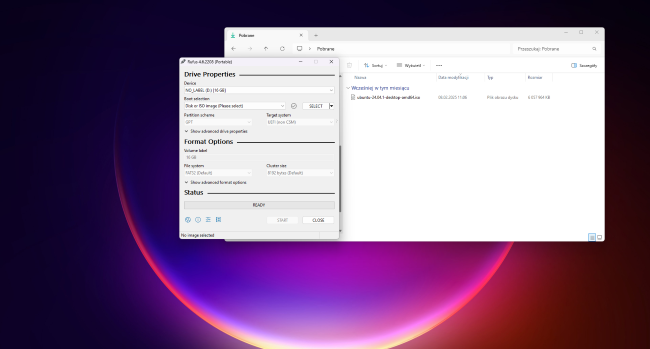
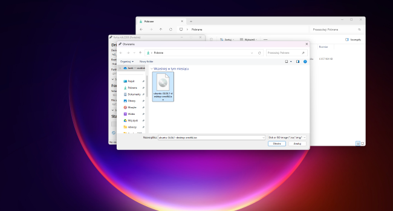
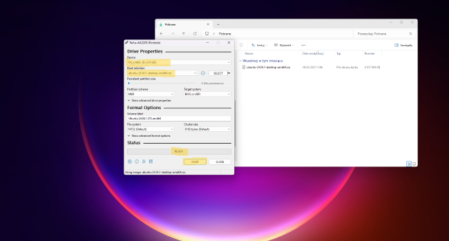
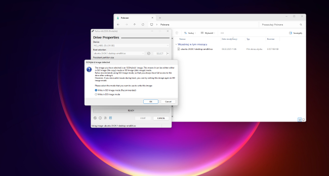
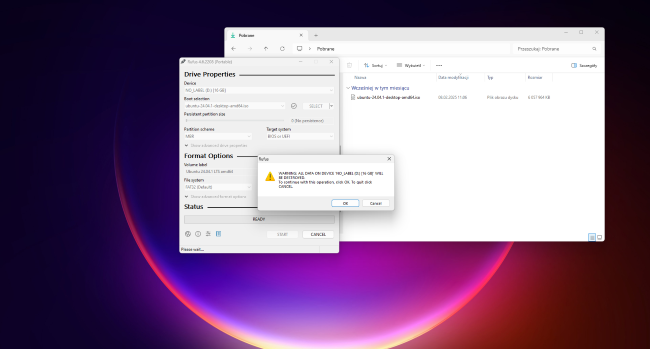
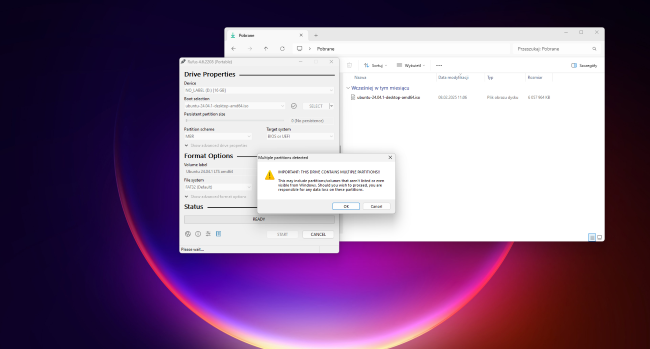
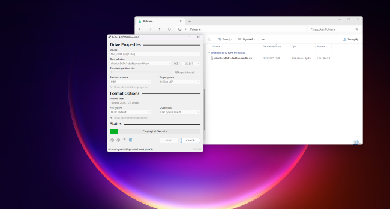
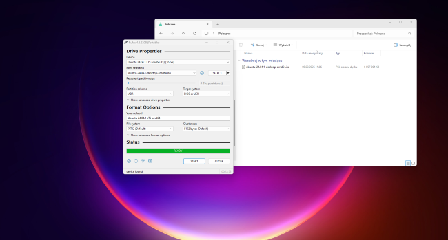
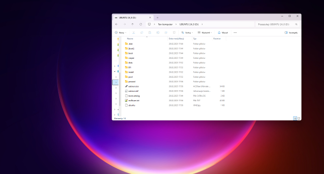

## Course preparations - Linux  

As we are going to go through programming stuff, there's no other way like to do it
in unix-like environment. Why this choice? Well, as much developer, as many answers
can be. I can share my thoughts on this matter.

When I've been starting to learn programming I loved to use my mac. My reason, why
I like unix-like systems is their stability and security. I had so many troubles
using Windows laptops (I had to, as my main job is automation engineering), especially,
when network connections had poor conditions, or one of the programs stopped responding. 
Computer in those cases was unusable. But in unix-like system, you can just kill the
process, and continue your work.  
Next reason was hardware requirements. If Windows works not so fast on your laptop, Linux
will be much faster and reliable.  
Last (my) reason is a huge library of development tools, which gives you ... freedom
of choice :)

1. ### System installation

You will need a few things, to proceed with Linux installation:
* USB memory stick, at least 8GB
* ISO file with Linux
* Tool to create bootable USB stick

Theres a lot of Linux distribution available (Arch, Debian, Mint etc.), however
Ubuntu seems to be most popular, and easiest to start with. To create bootable
USB stick with installation, you need to download ISO image from [here](https://ubuntu.com/download/desktop).
Choose a version with LTS (Long Time Support), as it is longer supported.

Next step will be to download a tool, that will make your USB stick bootable
with written ISO image on it. Again, there's big choice of such tools, however
I always use Rufus (download from [here](https://rufus.ie/en/)).

Now we will go through preparation of your installation media:
After you open Rufus, you see something like on picture below:

Next thing you need to do is to choose you USB stick:

By clicking **SELECT** you will choose ISO image to be written on USB stick:

When everything will be ready, you will se your USB stick, Ubuntu image,
status from Rufus ready. Just click Start:

You will see some communicates, before your USB stick will be converted into
boot media for ubuntu installation:  
+ which method you want to use (leave it default and click OK):

+ warning about erasing your data from USB stick (click OK):

+ warning that all partitions will be also erased (click OK):

Now Rufus should start working on your Ubuntu boo media:

When all process will be finished, you will see **READY** information.
Click **CLOSE**:

If you will now check what is on your USB stick, you should see something 
like this:

Your USB bootable media with Ubuntu is ready, and now we can work on your
hard drive, to get it prepared for installation. If you do not want to keep
Windows everything will be much easier, however, if you want to keep Windows 
aside of Linux, we need to prepare your hard drive for installation.

2. ### Linux basic commands and configuration
